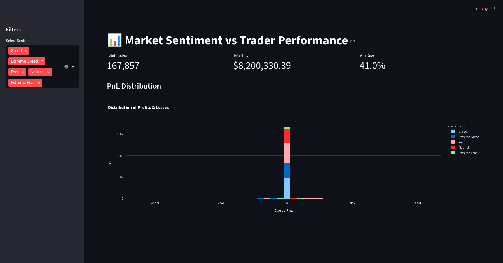

# Bitcoin Sentiment & Trader Behavior Analysis

## Overview
This project analyzes how **Market Sentiment (Fear vs. Greed)** impacts trader psychology and performance on Hyperliquid. Using data from 167,000+ trades, we clustered traders into archetypes and built a predictive model to forecast trade outcomes.



## Summary & Strategy (Part C)

### 1. Methodology
* **Data Integration:** Processed 167,000+ trade records, normalizing timestamps to a daily level to align with Bitcoin Fear & Greed index values.
* **Cleaning & Preprocessing:** Handled missing values and duplicates to ensure statistical integrity across a dataset spanning multiple market cycles.
* **Feature Engineering:** Calculated key metrics including daily PnL, win rates, and average trade sizes to serve as inputs for behavioral analysis.
* **Modeling:** Utilized **K-Means Clustering** for archetype discovery and a **Random Forest Classifier** to predict trade profitability based on sentiment and behavior.

### 2. Key Insights
* **The "Extreme Greed" Volatility:** While win rates peak at ~41% during Extreme Greed, these days also exhibit the widest variance in PnL, indicating high-risk, emotional trading.
* **The "Neutral" Trap:** Performance is consistently lowest during Neutral sentiment, suggesting that a lack of clear market momentum leads to directionless, unprofitable trading for retail participants.
* **Trader Archetypes:** Identified "Snipers" as the most successful segment—trading with lower frequency but higher conviction and generating **$1.9M in total PnL**.

### 3. Strategy Recommendations
* **Sentiment-Based Risk Filtering:** Traders should reduce leverage by 30-50% during "Extreme Greed" phases to protect against the observed high-variance price swings.
* **Defensive Neutral Stance:** During "Neutral" days, the strategy should pivot to tighter stop-losses or reduced trade frequency, as these conditions correlate with the highest probability of inconsistent "wash" trading.
* **The Sniper Filter:** Use the predictive model (72% accuracy) as an automated "entry-check"—only taking trades when both sentiment and behavioral clusters align with high-probability outcomes.

---

##Project Structure
* `notebooks/01_analysis.ipynb`: Detailed EDA, Data Cleaning, and Visualizations (Part A & B).
* `src/modeling.py`: Automated pipeline for Merging, Clustering, and Training the Predictive Model.
* `dashboard.py`: Interactive Streamlit App for exploring the data.
* `data/`: Contains raw CSVs (ignored by git) and processed data.

---

## Setup & Usage

### 1. Installation 
Clone the repository and install dependencies:
```bash
git clone [https://github.com/Kunal-Somani/primetrade-assignment.git](https://github.com/Kunal-Somani/primetrade-assignment.git)
cd primetrade-assignment
pip install -r requirements.txt
```

### 2. Run the Analysis
To execute the data processing pipeline, perform trader clustering, and train the predictive model:
```bash
streamlit run src/dashboard.py
```

### 3. Launch Dashboard
To launch the interactive Streamlit dashboard for visual exploration:
```bash
streamlit run dashboard.py
```
---

## Submitted by Kunal Somani for Primetrade.ai Internship
